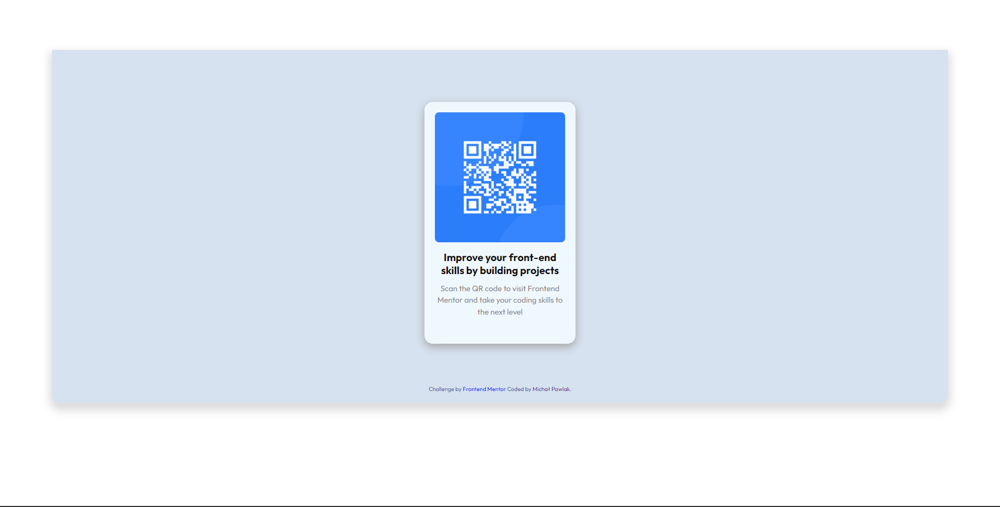

# Frontend Mentor - QR code component solution

This is a solution to the QR code component challenge on Frontend Mentor.

## Table of contents

- [Overview](#overview)
  - [Screenshot](#screenshots)
  - [Links](#links)
- [My process](#my-process)
  - [Built with](#built-with)
  - [What I learned](#what-i-learned)
- [Author](#author)

## Overview

### Screenshots

### Links

- Solution URL: [Add solution URL here](https://github.com/MichalPawlak0/Frontend-Mentor-QRCode)
- Live Site URL: [Add live site URL here](https://michal-pawlak-frontendmentor-qrcode.netlify.app)

## My process
Created HTML markup.
Added the qr code img.
Added CSS.
Created responsive design.

### Built with

- Semantic HTML5 markup
- CSS custom properties
- Flexbox
- CSS Grid
- Desktop-first workflow

### What I learned

This was basically a nice refresher. Used grid and flexbox nicely.

## Author

- Website - [Michał Pawlak](https://michal-pawlak.netlify.app/)
- Frontend Mentor - [@MichalPawlak0](https://www.frontendmentor.io/profile/yourusername)